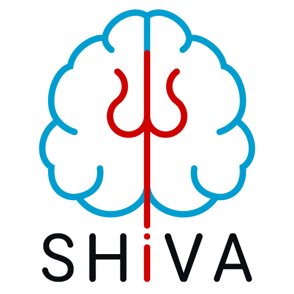
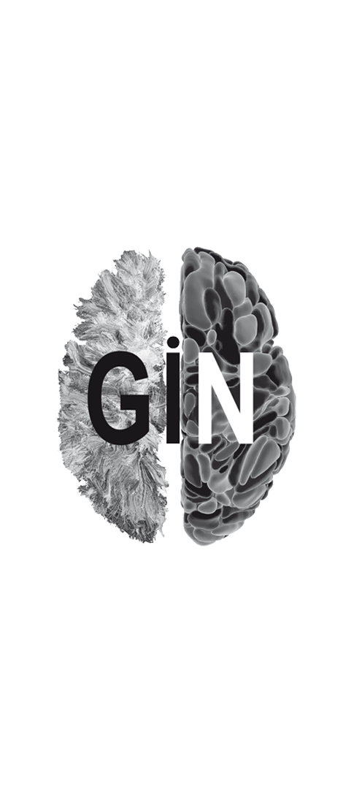
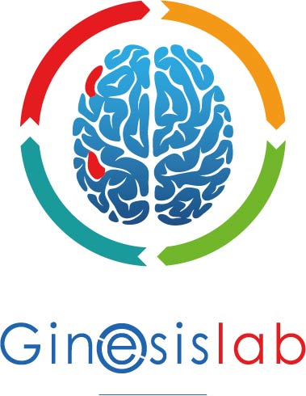

# Perivascular (PVS) or Virchow–Robin Spaces (VRS) segmentation with a 3D Unet

This repository contains the trained tensorflow models for the 3D Segmentation of Perivascular Spaces on either T1-Weighted or multi-modal T1-Weighted + FLAIR MR Images with a 3D U-Shaped Neural Network (U-net) as described in the scientific publication cited below.


## IP, Licencing

**The inferences created by these models should not be used for clinical purposes.**

The segmentation models in this repository have been registered at the french 'Association de Protection des Programmes' under the number:

[IDDN.FR.001.240015.000.S.P.2022.000.31230](https://secure2.iddn.org/app.server/certificate/?sn=2022240015000&key=49a9587d649cf21f07b8af86876765e775e531fe3b23f539c1dee75b78a838c4&lang=fr). 


The segmentation models in this repository are provided under the Creative Common Licence [BY-NC-SA](https://creativecommons.org/licenses/by-nc-sa/4.0/).


## The segmentation models
For mono-modal models trained with T1-Weighted images, the models were trained with images with a size of 160 × 214 × 176 x 1 voxels. The training was done with images with an isotropic voxel size of 1 × 1 × 1 mm3 and with normalized voxel values in [0, 1] (min-max normalization with the max set to the 99th percentile of the brain voxel values to avoid "hot spots"). The brain is supposed to be centered, the models are trained with and without a brain mask applied on images, the T1 images should be resampled carefully and if necessary.

For multi-modal models trained with T1 + FLAIR images, the models were trained with FLAIR images coregistered to the T1 and added as a second channel: 160 × 214 × 176 x 2 voxels.

The segmentation can be computed as the average of the inference of several models (depending on the number of folds used in the training for a particular model). The resulting segmentation is an image with voxels values in [0, 1] (proxy for the probability of detection of PVS) that must be thresholded to get the actual segmentation. A threshold of 0.5 has been used successfully but that depends on the preferred balance between precision and sensitivity.

To access the models :
* v2/T1.PVS : is a segmentation Unet-like model with residual blocks trained from transfert learning from other models (e.g. T2->CMB). It is able to segment PVS from T2 images if they are preprocessed with inverted voxels inside the brain mask. It was trained with Tensorflow  2.9.1 used with Python 3.9, indiviudal models are stored in the Tensorflow "SavedModel" format to avoid the H5 compatibility problems mentionned below.
    * due to file size limitation the models can be found [here](https://cloud.efixia.com/sharing/W0YpwQzzB) : https://cloud.efixia.com/sharing/W0YpwQzzB
    * Checksum : 9f8c6e1904f01657cdbabddf3caf4ef2
* v1/T1.PVS: is a segmentation model with incremental architecture enhancements done since the publication and is trained with a nonlinear voxel augmentation strategy that makes it more robust when used with degraded or resampled images.
    * due to file size limitation the models can be found [here](https://cloud.efixia.com/sharing/wknXOu07H) : https://cloud.efixia.com/sharing/wknXOu07H
    * Checksum : 90376aaa340e8cb0459f29a9f5f2007a
* v1/T1-FLAIR.PVS: is a multimodal segmentation model with the same architecture as the one above, using FLAIR provides a small performance increase.
    * due to file size limitation the models can be found [here](https://cloud.efixia.com/sharing/Dg49eKSPR) : https://cloud.efixia.com/sharing/Dg49eKSPR
    * Checksum : bef270c685f5d9bffaa28ab78576ba59
* v0/T1.PVS: is the segmentation model described in the publication
    * due to file size limitation the models can be found [here](https://cloud.efixia.com/sharing/dDqjx2DCq) : https://cloud.efixia.com/sharing/dDqjx2DCq
    * Checksum : 655938f815763c4a454370147f8d13e2

## Requirements
Unless otherwise mentionned, the models were trained with Tensorflow > 2.7 used with Python 3.7, they are stored in the H5 format (there is a compatibility problem when reading tendorflow H5 files by using Python version > 3.7).

A NVIDIA GPU with at least 9Go of RAM is needed to compute inferences with the trained models.

To run the `predict_one_file.py` script, you will need a python environment with the following librairies:
- tensorflow >= 2.7
- numpy
- nibabel
If you don't know anything about python environment and libraries, you can find some documentation and installers on the [Anaconda website](https://docs.anaconda.com/). We recommend using the lightweight [Miniconda](https://docs.anaconda.com/miniconda/).

## Usage
Step-by-step process to run the model:
1. Download the `predict_one_file.py` from the repository (clic the "<> Code" button on the GitHub interface and download the zip file, or clone the repository)
2. Download and unzip the trained models (see [above](#the-segmentation-models))
3. Preprocess the input data (swi or T2gre images) to the proper x-y-z volume (160 × 214 × 176). If the resolution is close to 1mm isotropic voxels, a simple cropping is enough. Otherwise, you will have to resample the images to 1mm isotropic voxels. For now, you will have to do it by yourself, but soon we will provide a full Shiva pipeline to run everything.
4. Run the `predict_one_file.py` script as described below
To run `predict_one_file.py` in your python environment you can check the help with the command `python predict_one_file.py -h` (replace "predict_one_file.py" with the full path to the script if it is not in the working directory).
Here is an example of usage of the script with the following inputs:
- The `predict_one_file.py` script stored in `/myhome/my_scripts/`
- Preprocessed Nifti images (volume shape must be 160 × 214 × 176 and voxel values between 0 and 1) stored (for the example) in the folder `/myhome/mydata/`
- The PVS AI models stored (for the example) in `/myhome/pvs_models/v1`
- The ouput folder (for the example) `/myhome/my_results` needs to exist at launch
```bash
python /myhome/my_scripts/predict_one_file.py -i /myhome/mydata/swi_image.nii.gz -b /myhome/mydata/input_brainmask.nii.gz -o /myhome/my_results/pvs_segmentation.nii.gz -m /myhome/pvs_models/v1/PVS_fold_1_model.h5 -m /myhome/pvs_models/v1/PVS_fold_2_model.h5 -m /myhome/pvs_models/v1/PVS_0_model.h5 
```
>Note that the brain mask input here with `-b /myhome/mydata/input_brainmask.nii.gz` is optional
## Building your own script
The provided python script `predict_one_file.py` can be used as is for running the model or can be used an example to build your own script.

Here is the main part of the script, assuming that the images are in a numpy array with the correct shape (*nb of images*, 160, 214, 176, *number of modality to use for this model*) and that you have enough CPU RAM to load all images in one array (else use a Tensorflow dataset) :
````python
# Load models & predict
predictions = []
for predictor_file in predictor_files:  # predictor_files is the list of the model's paths
    tf.keras.backend.clear_session()
    try:
        model = tf.keras.models.load_model(
            predictor_file,
            compile=False,
            custom_objects={"tf": tf})
    except Exception as err:
        print(f'\n\tWARNING : Exception loading model : {predictor_file}\n{err}')
        continue
    # compute the segmentation for this model
    prediction = model.predict(images)
    # append segmentation for this
    predictions.append(prediction)

# Average all predictions
predictions = np.mean(predictions, axis=0)
````

## Acknowledgements
This work has been done in collaboration between the [Fealinx](http://www.fealinx-biomedical.com/en/) company and the [GIN](https://www.gin.cnrs.fr/en/) laboratory (Groupe d'Imagerie Neurofonctionelle, UMR5293, IMN, Univ. Bordeaux, CEA , CNRS) with grants from the Agence Nationale de la Recherche (ANR) with the projects [GinesisLab](http://www.ginesislab.fr/) (ANR 16-LCV2-0006-01) and [SHIVA](https://rhu-shiva.com/en/) (ANR-18-RHUS-0002)

||||||
|---|---|---|---|---|


## Abstract
Implementation of a deep learning (DL) algorithm for the 3-dimensional segmentation of perivascular spaces (PVSs) in deep white matter (DWM) and basal ganglia (BG). This algorithm is based on an autoencoder and a U-shaped network (U-net), and was trained and tested using T1-weighted magnetic resonance imaging (MRI) data from a large database of 1,832 healthy young adults. An important feature of this approach is the ability to learn from relatively sparse data, which gives the present algorithm a major advantage over other DL algorithms. Here, we trained the algorithm with 40 T1-weighted MRI datasets in which all “visible” PVSs were manually annotated by an experienced operator. After learning, performance was assessed using another set of 10 MRI scans from the same database in which PVSs were also traced by the same operator and were checked by consensus with another experienced operator. The Sorensen-Dice coefficients for PVS voxel detection in DWM (resp. BG) were 0.51 (resp. 0.66), and 0.64 (resp. 0.71) for PVS cluster detection (volume threshold of 0.5 within a range of 0 to 1). Dice values above 0.90 could be reached for detecting PVSs larger than 10 mm3 and 0.95 for PVSs larger than 15 mm3. We then applied the trained algorithm to the rest of the database (1,782 individuals). The individual PVS load provided by the algorithm showed a high agreement with a semi-quantitative visual rating done by an independent expert rater, both for DWM and for BG. Finally, we applied the trained algorithm to an age-matched sample from another MRI database acquired using a different scanner. We obtained a very similar distribution of PVS load, demonstrating the interoperability of this algorithm.

## Publication

```
@ARTICLE{10.3389/fninf.2021.641600,
AUTHOR={Boutinaud, Philippe and Tsuchida, Ami and Laurent, Alexandre and Adonias, Filipa and Hanifehlou, Zahra and Nozais, Victor and Verrecchia, Violaine and Lampe, Leonie and Zhang, Junyi and Zhu, Yi-Cheng and Tzourio, Christophe and Mazoyer, Bernard and Joliot, Marc},
TITLE={3D Segmentation of Perivascular Spaces on T1-Weighted 3 Tesla MR Images With a Convolutional Autoencoder and a U-Shaped Neural Network},
JOURNAL={Frontiers in Neuroinformatics},
VOLUME={15},
YEAR={2021},  
URL={https://www.frontiersin.org/article/10.3389/fninf.2021.641600},
DOI={10.3389/fninf.2021.641600},
ISSN={1662-5196},
}
```
